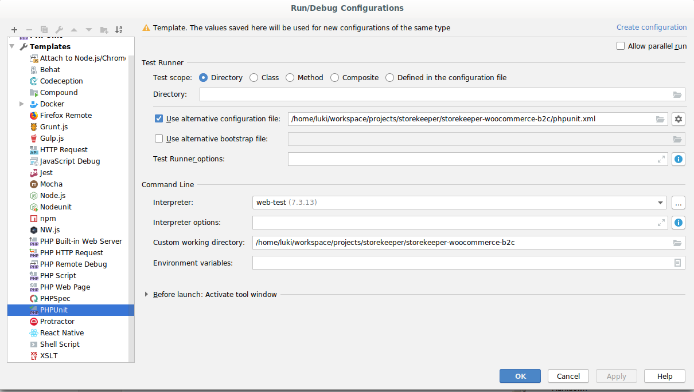
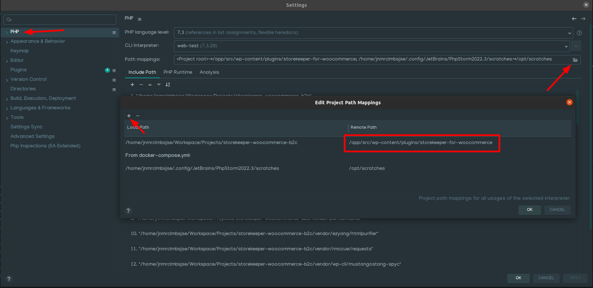
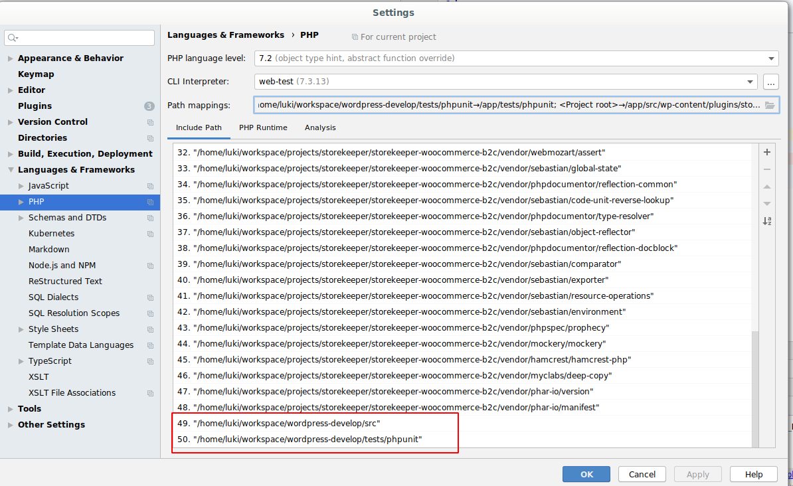
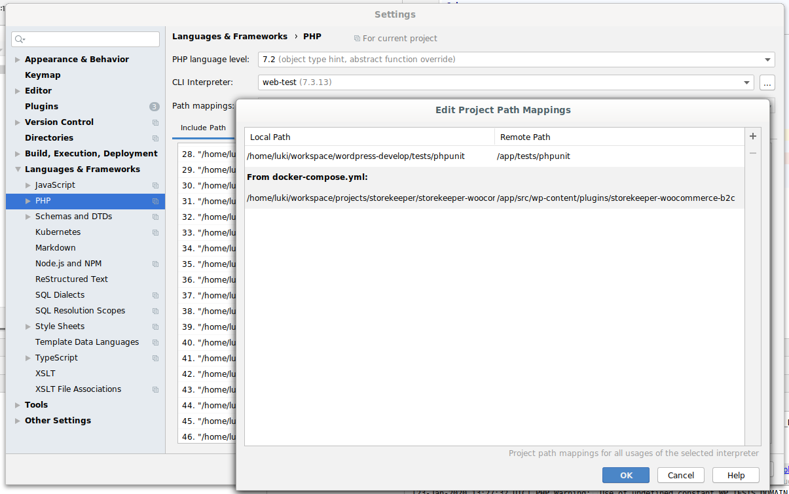
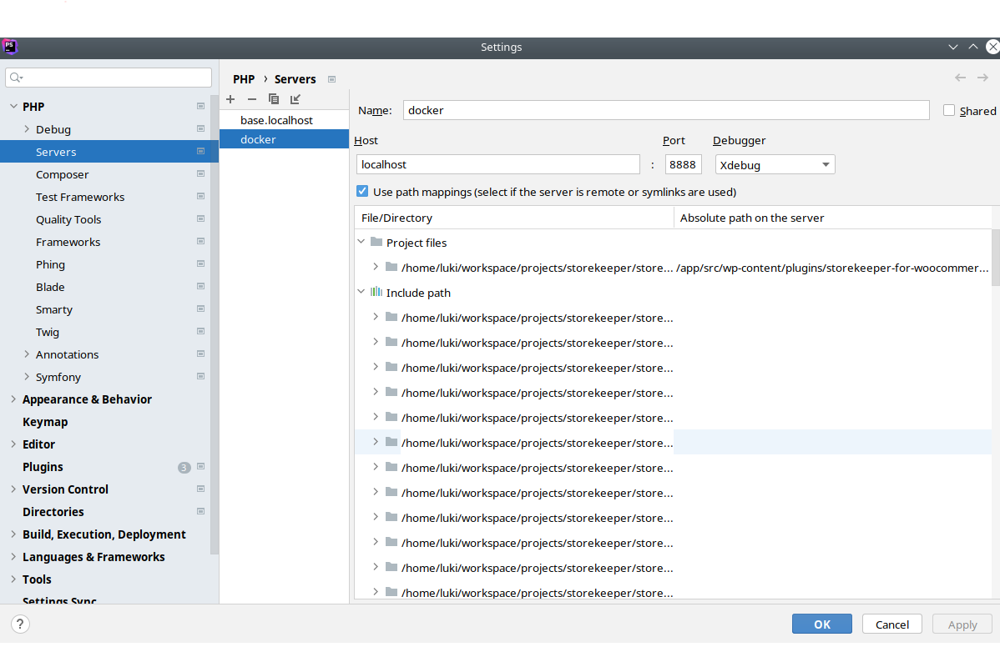
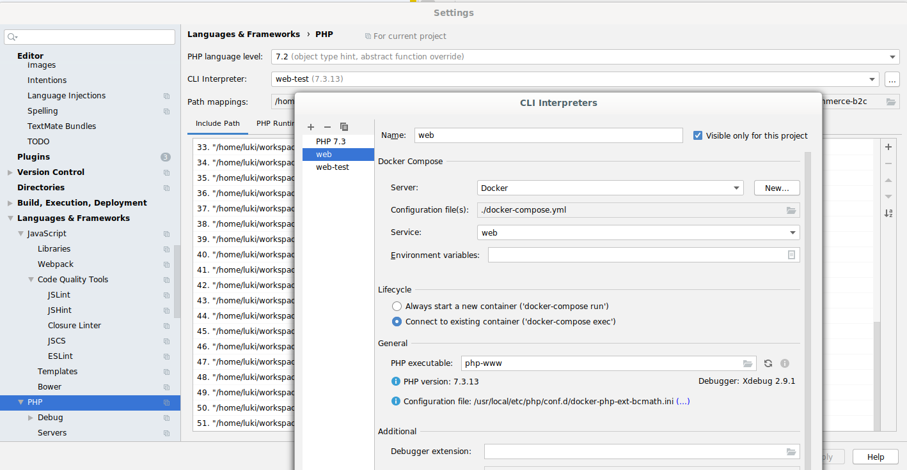
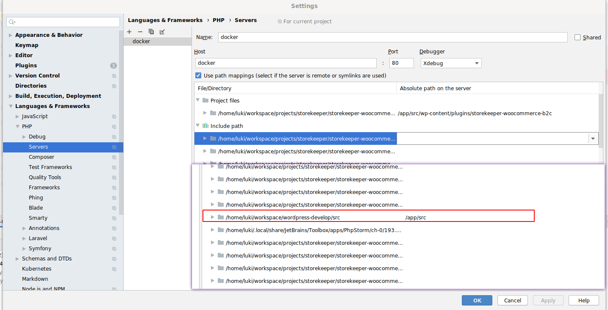
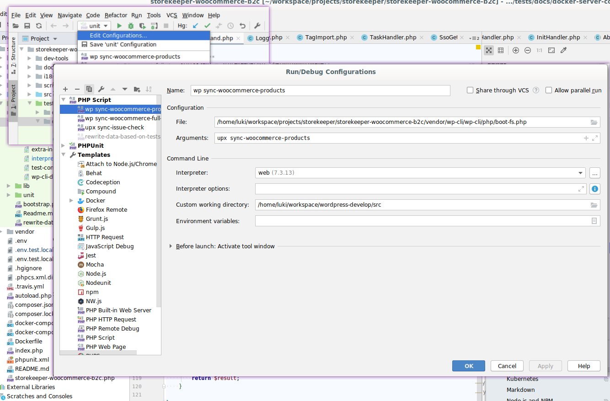

# StoreKeeper WooCommerce B2C

## Docker development

Start services

```bash
docker-compose up -d --build
```

Connect

```bash
docker-compose exec web bash
```

Setup the backend proxy. Add to ssh config:

```
Host b1.code4.pizza
    RemoteForward 8888 localhost:8888
```
After starting the ssh connection you can use the hooks.

Gotcha: only one developer can use it at the same time.

## Debugging

Debug is active if `WP_DEBUG` or `STOREKEEPER_WOOCOMMERCE_B2C_DEBUG` is true-ish


For different log error put in your `wp-config.php` 

```
define('STOREKEEPER_WOOCOMMERCE_B2C_LOG_LEVEL', 'DEBUG');
```

## Translations
Extract strings to be translated from the plugin, mostly all strings that are enclosed in `__("text to translate")` function and compile in in a `.pot` file.
```bash
make extract-translations
```

Download translations file in `.po` format from Lokalise.
```bash
make pull-translations
```

Upload translation template file (`.pot`) to Lokalise.
```bash
make push-translations
```

> Suggested sequence is to first run `make extract-translations` to get the latest strings, then run `make push-translations` to update Lokalise, and finally run `make pull-translations` to download the translated texts.

## PhpStorm setup

Define a new configuration template:


Setup path mapping


Add extra includes


Setup mappings


Setup mappings for local xdebug from on http://localhost:8888 using browser


Configure interpreter


Configure server to script debug


WP cli debug


## Setting up the webhook to local docker


Services like cloudflare zero conf tunnel can be used  can be used.
https://developers.cloudflare.com/cloudflare-one/connections/connect-apps/

Then change the `WordPress Address (URL)` and `Site Address (URL)` to the url given out by service.

You can now connect using the wp command (where url is the url given back by ngrok)
```bash
docker-compose exec web wp sk connect-backend https://extranal_url/
```

If you want to share the show externally set it's urls to the cloudflare zero conf tunnel url
```bash
docker-compose exec web  bash
root@8942cbe3780d:/app/src# wp search-replace http://localhost:8888 https://extranal_url/ --all-tables
```

After this you can set it back to default.
```bash
docker-compose exec web wp option set home http://localhost:8888/
docker-compose exec web wp option set siteurl http://localhost:8888/
```

## Using api/webhook dumps

Each time the api call or a webhook is being fired 
it will create new json file inside `./tmp/sk-tmp/dumps`. 
Those files can be used in unit tests in `tests/data`

### Place dump files in project

The dump files should be unified based on their parameters and moved to the correct location in the synchronisation plug-in project. The commands below are an example on how to to this for the sync-woocommerce-products dump files.

Unify the dump files based on the parameters used in the calls

`php tests/rewrite-data-based-on-tests.php tests/data/dumps`

Create the directory where to store the dump files in

`mkdir -p tests/data/commands/sync-woocommerce-products`

Copy the files to the correct directory

`mv tests/data/dumps/* tests/data/commands/sync-woocommerce-products`

Remove unneeded dump files. All dump files that begin with the date/time of creation can be removed from the tests/data dumpfile directory.

### Use dump files in tests

The best way to see how to use the data dump files in any unit test is to go to an existing unit test and see how it's done there. Below I've place the three most important functions.

Use data dump for api calls made by the unit test

`$this->mockApiCallsFromDirectory( DATADUMP_DIRECTORY, true );`

Read content of command datadump to use in the unit test

```php
$file = $this->getDataDump( PATH_TO_DATADUMP_SOURCE_FILE );
$data = $file->getReturn()['data'];
```
Read content of hook data dump to use in the unit test
```php
$file = $this->getHookDataDump( PATH_TO_DATADUMP_SOURCE_FILE );
```

## Adding sql migrations

Add new class in `src/StoreKeeper/WooCommerce/B2C/Migrations/Versions` than include this class as last in 
`StoreKeeper\WooCommerce\B2C\Migrations\AllVersions::VERSION`.

Version migration will run if plugin is updated or activated.

You can find the new version in `wp_storekeeper_migration_versions` table after update/activate.

When adding  migration versions keep in mind that [mysql has autocommit](https://dev.mysql.com/doc/refman/8.0/en/implicit-commit.html) 
on some changes. Make sure you place those in separate versions so the migrations remain atomic. 

## Make a new tagged release

Tagging a commit will trigger a release build on github.

```bash
git tag 5.2.0
git push origin 5.2.0
```
## Development notes

### Hooks
1. `storekeeper_order_tracking_message` - Used for overriding the default message for track & trace on customer order page.
   1. Type - `Filter`
   2. Parameters - `$message`,`$url`
   3. Triggering class - `StoreKeeper\WooCommerce\B2C\Frontend\Handlers\OrderHookHandler`
