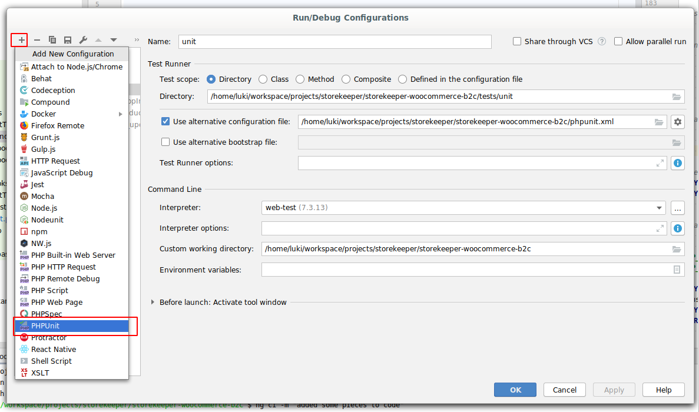

[TOC]

# Testing

## Docker environment

### Starting the test services

This build might take a while, because it's cloning a developer git repo and the docker file is quite big. Second time it will be way faster.

```bash
docker-compose -f docker-compose.test.yml up -d --build && docker-compose -f docker-compose.test.yml logs -f
```

### clean all

Only needed if you want to get rid of volumes.

```bash
docker-compose -f docker-compose.test.yml down -v 
```

## Unit tests

### Running tests from cli

#### All tests

```bash
docker-compose -f docker-compose.test.yml exec web-test run-unit-tests
```

#### Specyfic tests

```bash
docker-compose -f docker-compose.test.yml exec web-test run-unit-tests tests/unit/SampleTest.php
```

### Running tests from phpstorm

Please first configure your phpstorm as described in main [README.md](../README.md)

Define a new configuration template:


Create new test config:



### Creating new test

#### Simple test not needing any api/webhook integration

Make new file in `tests/unit` directory. See `./tests/unit/SampleTest.php` as example.
For specyfics see [PHPUnit documentation](https://phpunit.readthedocs.io/en/7.5/)

Note: We use phpunit 7, because as of 2020-01-02 wordpress does not support phpunit 8 version.

#### Test with api/webhook integration

Do be able to make tests agains the api wihtout requiring the api connection we dumped request/responses (leter called `dumps`).

Under the hood [mockery](http://docs.mockery.io/en/latest/) is used.

###### Creating new dumps

Fists choose what you want to test. Lets choose the `wp sk sync-woocommerce-products` for example.
At this point the developmetn account should be properly configure because it will use real connection to extract the data.

On dev docker: `docker-compose exec web bash`

```bash
rm -r /tmp/storekeeper-woocommerce-b2c/dumps/* # clean the old dumps
wp sk sync-woocommerce-products
```

Now download the locally

```bash
WEBID=`docker-compose ps -q web`
docker cp $WEBID:/tmp/storekeeper-woocommerce-b2c/dumps tests/data
```

If you want to have the commands unified by the parameters call locally. It won't remove the old files.

```bash
php tests/rewrite-data-based-on-tests.php tests/data/dumps
``` 

And your dumps are in tests/data/dumps ready to use.

Move the `dumps` to sepeare directory

```bash
mkdir -p tests/data/commands/sync-woocommerce-products && \
mv tests/data/dumps/* tests/data/commands/sync-woocommerce-products
```

###### Using dumps

See examples in `tests/unit/Commands` and `tests/unit/Endpoints/Webhooks`.


